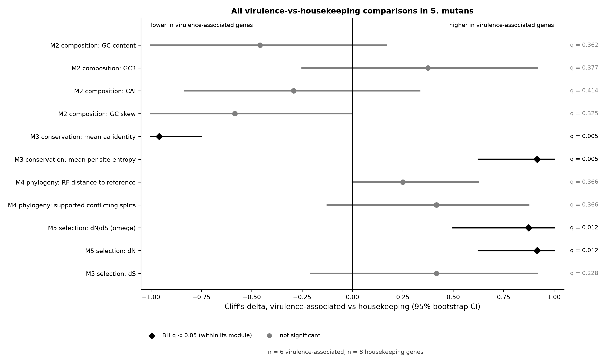
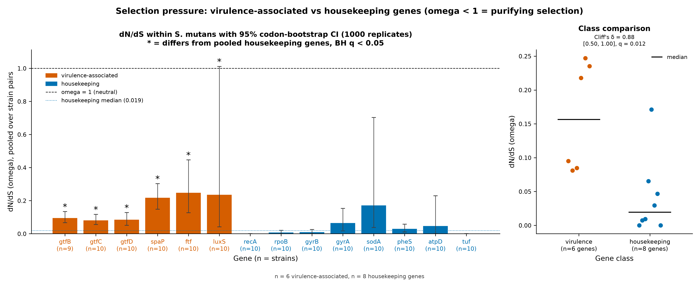
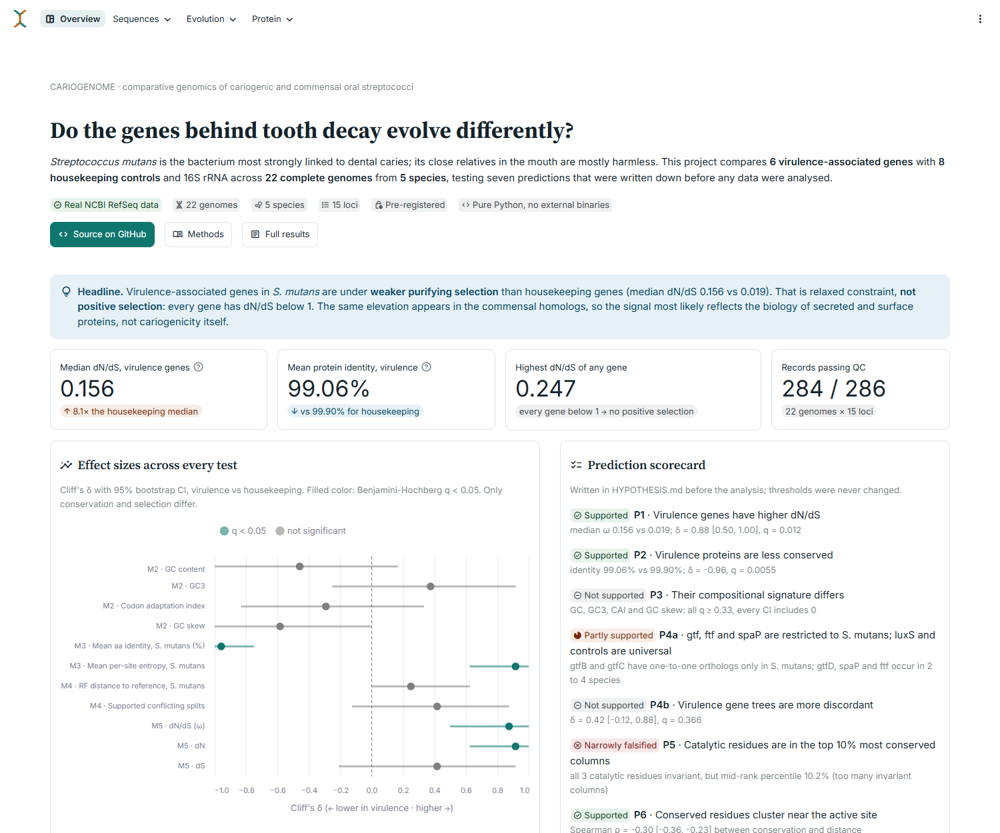
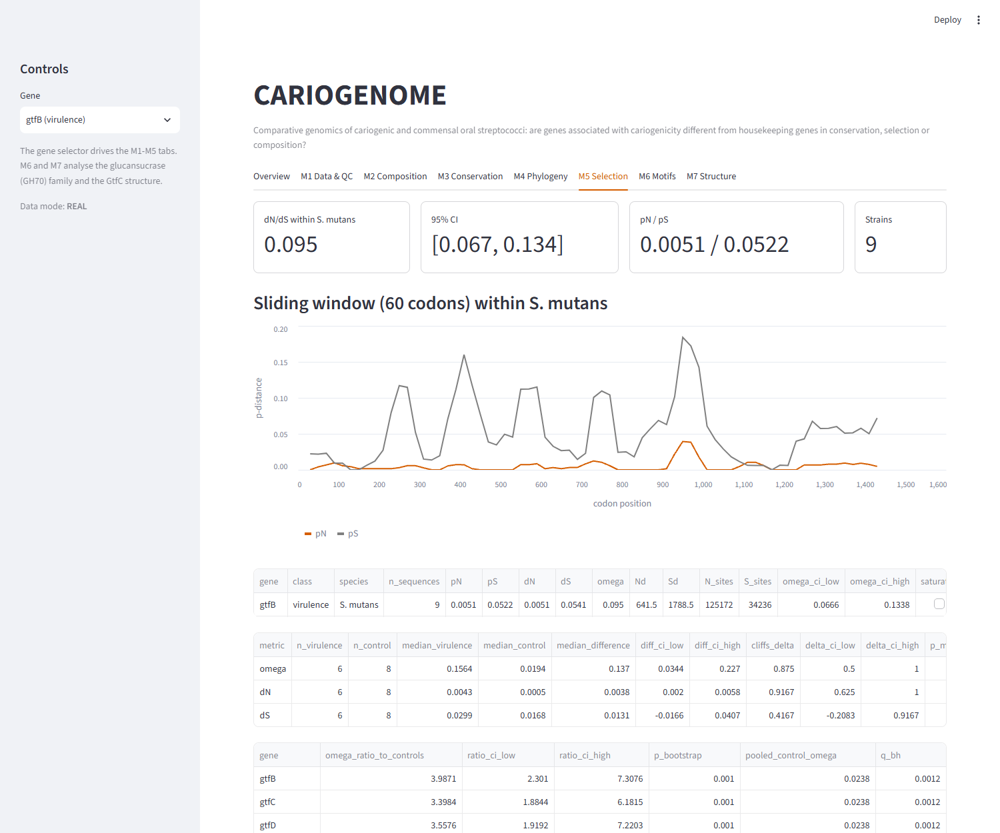
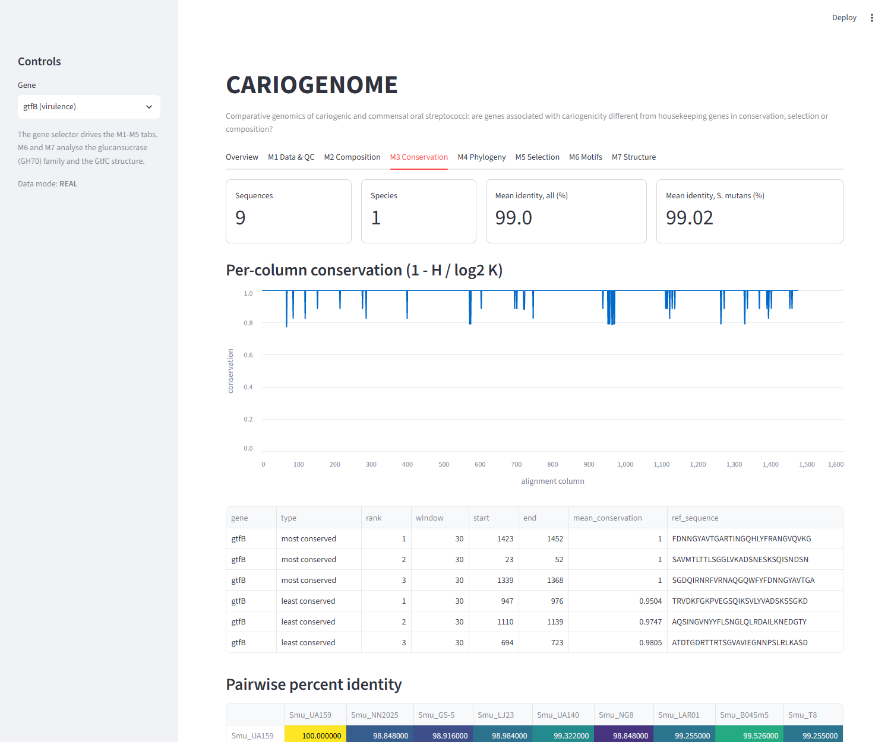
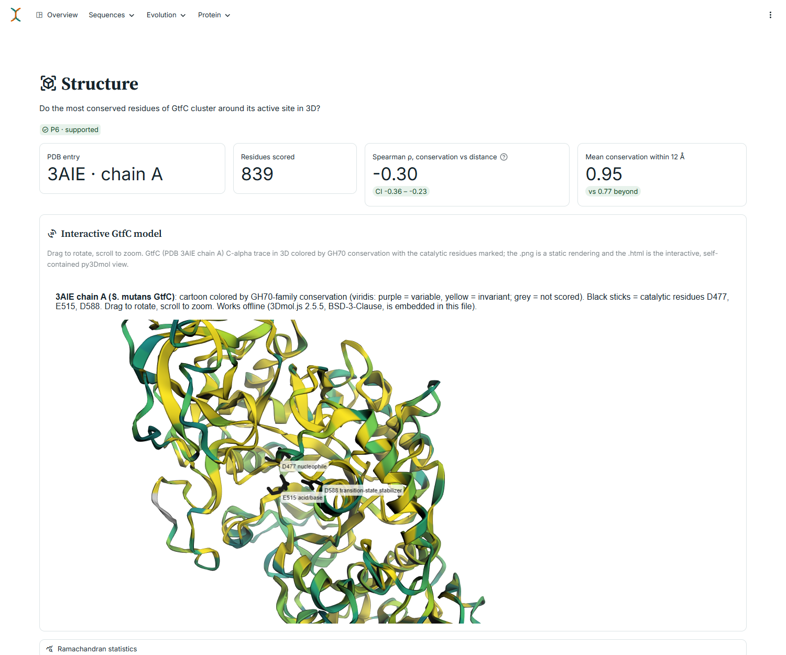

# CARIOGENOME

**Comparative genomics of cariogenic and commensal oral streptococci**

> **Headline.** Genes associated with tooth decay in *Streptococcus mutans* are under
> **weaker purifying selection** than housekeeping genes (median dN/dS 0.156 vs 0.019).
> That is relaxed constraint, **not positive selection**: every gene has dN/dS below 1.
> The same elevated dN/dS appears in the homologs of these genes in commensal species, so
> the signal most likely reflects the biology of secreted and surface-protein families,
> not cariogenicity specifically. One of the six pre-registered predictions failed, and
> the reason is given below.

This is a pure-Python pipeline (Biopython, NumPy, SciPy; no external bioinformatics
binaries) that compares 6 virulence-associated genes with 8 housekeeping controls and 16S
rRNA across 22 complete genomes from 5 species. It runs on a CPU in about 3 minutes.



## Contents

- [Question and design](#question-and-design)
- [Main findings](#main-findings)
- [Prediction scorecard](#prediction-scorecard)
- [What this project does not show](#what-this-project-does-not-show)
- [How the results relate to published work](#how-the-results-relate-to-published-work)
- [Results tables](#results-tables)
- [Dashboard](#dashboard)
- [How to run](#how-to-run)
- [Reproducibility](#reproducibility)
- [Methods by module](#methods-by-module)
- [Limitations](#limitations)
- [Licensing](#licensing)
- [Repository layout](#repository-layout)

## Question and design

*S. mutans* is strongly associated with dental caries, while its relatives *S. sanguinis*,
*S. gordonii*, *S. mitis* and *S. salivarius* are mostly commensal. **Do genes associated
with cariogenicity differ from housekeeping genes in conservation, selection pressure or
compositional signature?**

- **Virulence-associated genes (6):** the glucosyltransferases *gtfB*, *gtfC*, *gtfD*,
  the adhesin *spaP*, fructosyltransferase *ftf*, and quorum-sensing *luxS*.
- **Housekeeping controls (8):** *recA*, *rpoB*, *gyrB*, *gyrA*, *sodA*, *pheS*, *atpD*,
  *tuf*, plus 16S rRNA for composition and phylogeny.
- **Genomes:** 10 *S. mutans* strains and 3 strains of each commensal species, all
  complete RefSeq chromosomes ([ACCESSIONS.md](ACCESSIONS.md)).
- **Pre-registration:** predictions were written in [HYPOTHESIS.md](HYPOTHESIS.md) before
  any analysis; the git history shows the order.

## Main findings

All numbers come from `results/` (real NCBI data) and are checked against those files by
the test suite.

1. **Relaxed purifying selection, not positive selection.** Within *S. mutans*, the median
   dN/dS is 0.156 for virulence-associated genes vs 0.019 for housekeeping genes (Cliff's
   δ = 0.88 [0.50, 1.00], BH q = 0.012). The difference comes from dN, not dS. Every gene
   has ω < 1, and none of 579 sliding windows has a CI above 1.
2. **Lower conservation.** Mean amino-acid identity among *S. mutans* strains is 99.06% vs
   99.90% (δ = −0.96 [−1.00, −0.75], q = 0.0055).
3. **No compositional signature.** GC, GC3, CAI and GC skew do not differ (all q ≥ 0.33;
   all CIs include 0).
4. **No phylogenetic evidence of transfer between these species.** No protein-coding gene
   tree has a well-supported branch that mixes species. *gtfB* and *gtfC* have one-to-one
   orthologs only in *S. mutans*.
5. **The pattern is shared with commensals.** Homologs of the virulence-associated genes
   in commensal species also have elevated dN/dS (e.g. *S. gordonii* median 0.138 vs
   0.011). This analysis was added after seeing the data and is exploratory.
6. **The glucansucrase active site is invariant and structurally central, but the
   pre-registered test of it failed.** The GtfC catalytic residues D477, E515 and D588 are
   invariant across 11 GH70 enzymes, and on the crystal structure conservation falls with
   distance from the active site (Spearman ρ = −0.30 [−0.36, −0.23]). However, 20.4% of
   all alignment columns are also invariant, so with ties shared the residues rank in the
   top 10.2% of columns. **Prediction P5 ("top 10%") therefore failed as written.** The
   threshold was the wrong test for data with so many ties; the rule was fixed before the
   run and was not changed afterwards.

Full evaluation of each prediction: [RESULTS_DISCUSSION.md](RESULTS_DISCUSSION.md).

## Prediction scorecard

| Prediction | Verdict | Key number |
|---|---|---|
| P1 Virulence genes have higher dN/dS | **Supported** (relaxed constraint, not positive selection) | median ω 0.156 vs 0.019; Cliff's δ = 0.88 [0.50, 1.00], q = 0.012 |
| P2 Virulence proteins are less conserved | **Supported** | identity 99.06% vs 99.90%; δ = −0.96 [−1.00, −0.75], q = 0.0055 |
| P3 Compositional signature differs | **Not supported** | all 4 metrics q ≥ 0.33, all CIs include 0 |
| P4a gtf/ftf/spaP restricted to *S. mutans*; luxS and controls universal | **Partly supported** | gtfB, gtfC one-to-one orthologs only in *S. mutans*; gtfD, spaP, ftf present in 2–4 species |
| P4b Virulence gene trees more discordant | **Not supported** | δ = 0.42 [−0.12, 0.88], q = 0.366; no coding gene has a supported species-mixing conflict |
| P5 Catalytic residues in the top 10% most conserved columns | **Narrowly falsified as stated** | all 3 invariant, but mid-rank percentile 10.2% (20.4% of columns are invariant) |
| P6 Conserved residues cluster near the active site | **Supported** | Spearman ρ = −0.30 [−0.36, −0.23] |

## What this project does not show

- **It does not show a cariogenicity-specific signature.** The elevated dN/dS of the
  virulence-associated genes is also seen in their commensal homologs (*S. gordonii*,
  *S. salivarius*, *S. sanguinis*), so it is better explained by the kind of protein
  (secreted, surface-exposed) than by a role in caries.
- **It cannot separate the gene classes by tree discordance within *S. mutans*.** Strain
  relationships are so poorly resolved that the normalized Robinson-Foulds distance to the
  reference tree is about 1 for 12 of 14 coding genes. The metric is saturated; a
  non-significant result here says nothing either way.
- **It cannot estimate dN/dS between species.** Synonymous sites between *S. mutans* and
  every commensal are saturated (pS 0.34–0.81; 37 of 42 comparisons above the 0.60
  threshold), so selection is measured only within species, where dN/dS reflects
  polymorphism rather than long-term divergence.
- **It does not show that any gene or variant causes disease,** and it makes no clinical,
  diagnostic or therapeutic claim.

## How the results relate to published work

Hoshino, Fujiwara & Kawabata (2012, *Sci Rep* 2:518, PMID 22816041) proposed from a
phylogeny of GH70 enzymes that streptococcal glucosyltransferase genes were acquired
horizontally from other lactic acid bacteria and later duplicated within genomes. Our
data fit the duplication part: *gtfB* and *gtfC* are adjacent paralogs present only in
*S. mutans*, whereas *S. sanguinis* and *S. gordonii* carry a single GH70 enzyme. Our design
cannot test the proposed transfer from lactobacilli, because no lactic acid bacteria were
sampled. The absence of a compositional signature is expected for an old transfer, since
transferred genes gradually take on the base composition of the recipient genome
(amelioration; Lawrence & Ochman 1997, *J Mol Evol* 44:383, PMID 9089078).

Cornejo et al. (2013, *Mol Biol Evol* 30:881, PMID 23228887) analysed 57 *S. mutans*
genomes. They found that most amino-acid-changing variation is under strong negative
selection and identified 14 genes under positive selection, mostly involved in sugar
metabolism or acid tolerance. Our result that every gene has dN/dS below 1 agrees with the
first point. Our 6-gene panel and pairwise pooled estimator cannot test for the episodic
positive selection they detected, so the absence of positive selection here is not
evidence against their findings.

The within-species dN/dS values reported here are inflated relative to between-species
divergence, as expected for closely related bacterial genomes (Rocha et al. 2006,
*J Theor Biol* 239:226, PMID 16239014). This is why only classes measured the same way are
compared. The GtfC structure and residue numbering follow Ito et al. (2011, *J Mol Biol*
408:177, PMID 21354427).

The main limit on these comparisons is the panel size: 6 virulence-associated genes cannot
represent the hundreds of genes implicated in *S. mutans* biology, and 10 strains are far
fewer than the population samples used in the studies above.

## Results tables

**Virulence vs housekeeping genes in *S. mutans*** (6 vs 8 genes; gene means over 9–10
strains; from `results/summary_effect_sizes.csv`)

| Module | Metric | Virulence median | Control median | Cliff's δ [95% CI] | BH q |
|---|---|---|---|---|---|
| M2 | GC content | 0.397 | 0.404 | −0.46 [−1.00, 0.17] | 0.362 |
| M2 | GC3 | 0.299 | 0.267 | 0.38 [−0.25, 0.92] | 0.377 |
| M2 | CAI | 0.558 | 0.578 | −0.29 [−0.83, 0.33] | 0.414 |
| M2 | GC skew | 0.055 | 0.124 | −0.58 [−1.00, 0.00] | 0.325 |
| M3 | Mean aa identity (%) | 99.06 | 99.90 | −0.96 [−1.00, −0.75] | 0.0055 |
| M3 | Mean per-site entropy (bits) | 0.0193 | 0.0021 | 0.92 [0.62, 1.00] | 0.0055 |
| M4 | Normalized RF to reference (within *S. mutans*) | 1.00 | 1.00 | 0.25 [0.00, 0.62] | 0.366 |
| M4 | Supported conflicting splits | 4 | 3 | 0.42 [−0.12, 0.88] | 0.366 |
| M5 | dN/dS (ω) | 0.156 | 0.019 | 0.88 [0.50, 1.00] | 0.012 |
| M5 | dN | 0.0043 | 0.0005 | 0.92 [0.62, 1.00] | 0.012 |
| M5 | dS | 0.0299 | 0.0168 | 0.42 [−0.21, 0.92] | 0.228 |

**dN/dS per gene within *S. mutans*** (pooled over 45 strain pairs, 36 for *gtfB*; 95%
codon-bootstrap CI, 1000 replicates; from `results/m5_dnds_Smutans.csv`)

| Gene | Class | ω [95% CI] |
|---|---|---|
| gtfB | virulence | 0.095 [0.067, 0.134] |
| gtfC | virulence | 0.081 [0.056, 0.117] |
| gtfD | virulence | 0.085 [0.050, 0.128] |
| spaP | virulence | 0.218 [0.148, 0.303] |
| ftf | virulence | 0.247 [0.127, 0.446] |
| luxS | virulence | 0.235 [0.041, 1.011] |
| recA | housekeeping | 0.000 [0.000, 0.000] |
| rpoB | housekeeping | 0.007 [0.000, 0.020] |
| gyrB | housekeeping | 0.009 [0.000, 0.026] |
| gyrA | housekeeping | 0.065 [0.017, 0.153] |
| sodA | housekeeping | 0.171 [0.037, 0.703] |
| pheS | housekeeping | 0.029 [0.011, 0.057] |
| atpD | housekeeping | 0.047 [0.000, 0.229] |
| tuf | housekeeping | 0.000 [0.000, 0.000] |

**GtfC catalytic residues in the GH70 family** (11 enzymes, 1545 scored columns, 20.4%
invariant; from `results/m6_catalytic_residues.csv`)

| Residue | Role | Motif | Conservation | Mid-rank percentile |
|---|---|---|---|---|
| D477 | nucleophile | region II | 1.00 | top 10.2% |
| E515 | acid/base | region III | 1.00 | top 10.2% |
| D588 | transition-state stabilizer | region IV | 1.00 | top 10.2% |

**Method validation on simulated data** (`results/validation_synthetic_summary.csv`): the
true 22-taxon topology is recovered exactly (normalized RF = 0.0) and ω is recovered with
Spearman ρ = 0.991 and a median relative error of 8.8%.

All 28 figures (300 dpi, one colorblind-safe palette: vermillion = virulence-associated,
blue = housekeeping) are listed with one-line captions in
[figures/CAPTIONS.md](figures/CAPTIONS.md). A self-contained interactive 3D view of GtfC
colored by conservation is [figures/26_m7_structure_3d.html](figures/26_m7_structure_3d.html)
(opens offline in any browser).



## Dashboard

`streamlit run app.py` opens a dashboard with an overview tab, one tab per module, and a
gene selector. Screenshots (1500 × 1250 browser window):

| Overview | Selection (M5) |
|:---:|:---:|
|  |  |

| Conservation (M3) | Structure (M7) |
|:---:|:---:|
|  |  |

## How to run

Requires Python 3.10 or newer (developed on 3.14, Windows 11). No GPU and no external
binaries. The package does **not** need to be installed: `run_all.py` and `app.py` add
`src/` to the import path, and pytest does the same through `pyproject.toml`.
(`pip install -e .` also works if you prefer.)

**Windows (PowerShell or cmd)**

```bat
python -m venv .venv
.venv\Scripts\python -m pip install -r requirements.txt
.venv\Scripts\python run_all.py --offline
.venv\Scripts\python -m pytest
.venv\Scripts\streamlit run app.py
```

**macOS / Linux**

```sh
python3 -m venv .venv
.venv/bin/python -m pip install -r requirements.txt
.venv/bin/python run_all.py --offline
.venv/bin/python -m pytest
.venv/bin/streamlit run app.py
```

**`run_all.py` options** (they can be combined):

| Option | Effect |
|---|---|
| *(none)* | Use the local genome cache in `data/raw/` if present, otherwise download from NCBI (needs a contact email, see below). Falls back to the committed sequence cache, then to simulated data. |
| `--offline` | Never touch the network. Uses the committed sequences in `data/genes/` and the committed structure in `data/structure/`. Reproduces every result. |
| `--clean` | Delete `results/` and all generated figures before running. |
| `--synthetic` | Use simulated sequences only (every output labelled SYNTHETIC). |
| `--out DIR` | Write `data/`, `results/` and `figures/` under `DIR` instead of the repository (useful with `--synthetic`). |

**NCBI contact email.** NCBI requires an email address for downloads. The committed
`config.yaml` holds the placeholder `REPLACE_WITH_YOUR_EMAIL`, and a download attempted
with it stops with a readable error. Set your own address without editing any tracked
file:

```bat
set NCBI_EMAIL=you@example.org
```

```sh
export NCBI_EMAIL=you@example.org
```

Development tools (linter and type checker) are pinned separately in
`requirements-dev.txt`.

## Reproducibility

- Every random step uses a fixed seed from `config.yaml`, including bootstraps and
  jitter; nothing runs in parallel.
- Two consecutive runs produce byte-identical files, and a fresh clone with a new virtual
  environment running `run_all.py --clean --offline` reproduces every file in `results/`
  byte for byte.
- The one expected difference is `results/runtimes.tsv`, which records wall-clock time
  per step and therefore changes on every run.
- `--offline` was verified with all network connections blocked, not only with a warm
  cache.

## Methods by module

The formulas are written out in [METHODS.md](METHODS.md); every judgment call is in
[DECISIONS.md](DECISIONS.md).

- **M1 Retrieval and QC** (`m1_retrieval.py`, `m1_qc.py`, `homology.py`): Bio.Entrez
  download of complete RefSeq chromosomes. Orthologs are called by reciprocal best hit
  (k-mer prefilter plus Smith-Waterman, BLOSUM62), with a documented QC exclusion rule;
  284 of 286 records pass.
- **M2 Composition** (`m2_composition.py`, `codon.py`): GC, GC1–3, GC skew, RSCU, the
  Codon Adaptation Index (reference: ribosomal-protein genes of the same genome), and
  amino-acid composition. Gene-level Mann-Whitney tests, Cliff's δ with bootstrap CIs,
  and Benjamini-Hochberg correction.
- **M3 Alignment and conservation** (`alignment.py`, `m3_conservation.py`): pairwise
  global alignments give identity matrices. A center-star progressive MSA and codon
  back-translation follow. Conservation is Henikoff-weighted Shannon entropy per column.
- **M4 Phylogenetics** (`phylo.py`, `m4_phylogeny.py`): K2P distances, neighbor-joining
  and UPGMA (Bio.Phylo), 100 bootstrap replicates scored on unrooted splits, and a
  concatenated housekeeping reference tree. Discordance is measured by Robinson-Foulds
  distance and supported conflicting splits.
- **M5 Selection** (`dnds.py`, `m5_selection.py`): Nei-Gojobori dN/dS pooled over strain
  pairs, a 1000-replicate codon bootstrap, a synonymous-saturation check, sliding windows
  and per-species replication. Cross-checked against `Bio.codonalign`.
- **M6 Motifs** (`m6_motifs.py`): entropy-based conserved motifs in the GH70
  glucansucrase family, position weight matrices, sequence logos, and the conservation
  rank of the catalytic residues (assigned from the canonical GH70 motifs).
- **M7 Structure** (`m7_structure.py`): PDB 3AIE (*S. mutans* GtfC) with conservation
  mapped to the B-factor column, a self-contained py3Dmol view plus a static rendering,
  the distance-to-active-site correlation, and a Ramachandran plot.

## Limitations

- **Small gene panel.** 6 virulence-associated vs 8 housekeeping genes means only large
  class differences can be detected. Non-significant results mean "no evidence of a
  difference", not "no difference".
- **Distance-based phylogenetics.** NJ and UPGMA on K2P distances, not maximum likelihood
  or Bayesian inference; distance methods discard site-pattern information and use a
  simple substitution model.
- **Approximate progressive alignment.** The center-star MSA does not optimize gaps
  between non-center sequences; MUSCLE or MAFFT would be better.
- **Limited strain sampling.** 10 *S. mutans* and 3 strains of each commensal species.
- **Sequence signatures do not establish function.** A dN/dS value or a conservation
  score is evidence about evolutionary history, not proof that a gene contributes to
  disease.
- **Orthology by reciprocal best hit** can miss orthologs within paralog families (the
  commensal GH70 enzymes map to *gtfD*), so "absent" means "no one-to-one ortholog".
- **The virulence set is heterogeneous.** *luxS* is a metabolic enzyme found in every
  species.

## Licensing

Code and data carry **different terms**:

- **Code** (everything in `src/`, `tests/`, `run_all.py`, `app.py`): MIT License, see
  [LICENSE](LICENSE).
- **Data**: the sequences are NCBI RefSeq records and the structure is RCSB PDB entry
  3AIE, each under its provider's terms; the vendored 3Dmol.js library is BSD-3-Clause.
  Provenance, access dates and required citations are in [LICENSE-DATA](LICENSE-DATA).

## Repository layout

```
config.yaml               genomes, gene panel, parameters, seeds
run_all.py                regenerates everything
app.py                    Streamlit dashboard
src/cariogenome/          one module per analysis (m1_ ... m7_) plus shared helpers
tests/                    pytest suite (methods, synthetic recovery, docs, dashboard)
data/genes, data/genbank  extracted sequences (FASTA + GenBank)
data/genomes              CAI reference sets and genome CDS backgrounds
data/structure            GtfC chain A (PDB 3AIE)
data/vendor               3Dmol.js 2.5.5 and its license
results/                  every table behind every number
figures/                  28 figures at 300 dpi, the interactive structure page, captions
```

Project documents: [HYPOTHESIS.md](HYPOTHESIS.md) ·
[RESULTS_DISCUSSION.md](RESULTS_DISCUSSION.md) · [METHODS.md](METHODS.md) ·
[DECISIONS.md](DECISIONS.md) · [ACCESSIONS.md](ACCESSIONS.md) ·
[INTERVIEW_PREP.md](INTERVIEW_PREP.md)
