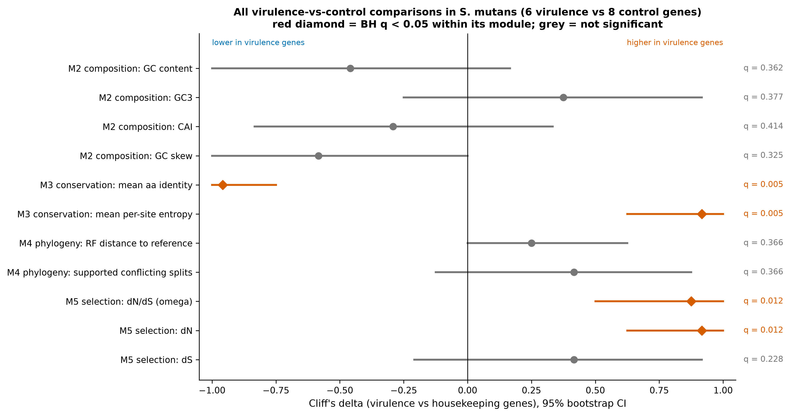

# CARIOGENOME

**Comparative genomics of cariogenic and commensal oral streptococci**

*Streptococcus mutans* is strongly associated with dental caries, while its close
relatives *S. sanguinis*, *S. gordonii*, *S. mitis* and *S. salivarius* are mostly
commensal. This project asks: **do the genes associated with cariogenicity differ from
housekeeping genes in sequence conservation, selection pressure or compositional
signature?**

It compares 6 virulence-associated genes (the glucosyltransferases *gtfB*, *gtfC*,
*gtfD*, the adhesin *spaP*, fructosyltransferase *ftf*, and quorum-sensing *luxS*) with 8
housekeeping controls (*recA*, *rpoB*, *gyrB*, *gyrA*, *sodA*, *pheS*, *atpD*, *tuf*) and
16S rRNA, across 22 complete genomes from 5 species. Everything is pure Python (Biopython,
NumPy, SciPy), with no external bioinformatics binaries, and runs on a CPU in about
3 minutes.



## Main findings

All numbers come from `results/` (real NCBI data). Predictions were written before the
analysis (`HYPOTHESIS.md`).

1. **Virulence genes are under weaker purifying selection, not positive selection.**
   Within *S. mutans*, the median dN/dS is 0.156 for virulence genes vs 0.019 for
   housekeeping genes (Cliff's δ = 0.88 [0.50, 1.00], BH q = 0.012). The difference comes
   from dN, not dS. Every gene has ω < 1, and no sliding window has a CI above 1.
2. **Virulence proteins are less conserved** among *S. mutans* strains: mean identity
   99.06% vs 99.90% (δ = −0.96 [−1.00, −0.75], q = 0.0055).
3. **No compositional signature.** GC, GC3, CAI and GC skew do not differ (all q ≥ 0.33;
   all CIs include 0).
4. **No phylogenetic evidence of inter-species transfer.** No protein-coding gene tree has
   a well-supported branch that mixes species. *gtfB* and *gtfC* have one-to-one
   orthologs only in *S. mutans*.
5. **The same elevated dN/dS appears in commensal homologs** (e.g. *S. gordonii* median
   0.138 vs 0.011). It looks like a property of secreted and surface-protein families,
   not a cariogenic-specific signature.
6. **The glucansucrase active site is invariant and structurally central.** The GtfC
   catalytic residues D477, E515 and D588 are invariant across 11 GH70 enzymes. On the
   crystal structure, conservation falls with distance from the active site (Spearman
   ρ = −0.30 [−0.36, −0.23]).

Prediction-by-prediction evaluation, including the failures:
[RESULTS_DISCUSSION.md](RESULTS_DISCUSSION.md).

## Results tables

**Virulence vs housekeeping genes in *S. mutans*** (6 vs 8 genes; gene means over 9–10
strains) — `results/summary_effect_sizes.csv`

| Module | Metric | Virulence median | Control median | Cliff's δ [95% CI] | BH q |
|---|---|---|---|---|---|
| M2 | GC content | 0.397 | 0.404 | −0.46 [−1.00, 0.17] | 0.362 |
| M2 | GC3 | 0.299 | 0.267 | 0.38 [−0.25, 0.92] | 0.377 |
| M2 | CAI | 0.558 | 0.578 | −0.29 [−0.83, 0.33] | 0.414 |
| M2 | GC skew | 0.055 | 0.124 | −0.58 [−1.00, 0.00] | 0.325 |
| M3 | Mean aa identity (%) | 99.06 | 99.90 | −0.96 [−1.00, −0.75] | 0.0055 |
| M3 | Mean per-site entropy (bits) | 0.0193 | 0.0021 | 0.92 [0.62, 1.00] | 0.0055 |
| M4 | Normalized RF to reference (within *S. mutans*) | 1.00 | 1.00 | 0.25 [0.00, 0.62] | 0.366 |
| M4 | Supported conflicting splits | 4 | 3 | 0.42 [−0.12, 0.88] | 0.366 |
| M5 | dN/dS (ω) | 0.156 | 0.019 | 0.88 [0.50, 1.00] | 0.012 |
| M5 | dN | 0.0043 | 0.0005 | 0.92 [0.62, 1.00] | 0.012 |
| M5 | dS | 0.0299 | 0.0168 | 0.42 [−0.21, 0.92] | 0.228 |

**dN/dS per gene within *S. mutans*** (pooled over 45 strain pairs, 36 for *gtfB*; 95%
codon-bootstrap CI, 1000 replicates) — `results/m5_dnds_Smutans.csv`

| Virulence | ω [95% CI] | Housekeeping | ω [95% CI] |
|---|---|---|---|
| gtfB | 0.095 [0.067, 0.134] | recA | 0.000 [0.000, 0.000] |
| gtfC | 0.081 [0.056, 0.117] | rpoB | 0.007 [0.000, 0.020] |
| gtfD | 0.085 [0.050, 0.128] | gyrB | 0.009 [0.000, 0.026] |
| spaP | 0.218 [0.148, 0.303] | gyrA | 0.065 [0.017, 0.153] |
| ftf | 0.247 [0.127, 0.446] | sodA | 0.171 [0.037, 0.703] |
| luxS | 0.235 [0.041, 1.011] | pheS | 0.029 [0.011, 0.057] |
| | | atpD | 0.047 [0.000, 0.229] |
| | | tuf | 0.000 [0.000, 0.000] |

**GtfC catalytic residues in the GH70 family** (11 enzymes, 1545 scored columns, 20.4%
invariant) — `results/m6_catalytic_residues.csv`

| Residue | Role | Motif | Conservation | Mid-rank percentile |
|---|---|---|---|---|
| D477 | nucleophile | region II | 1.00 | top 10.2% |
| E515 | acid/base | region III | 1.00 | top 10.2% |
| D588 | transition-state stabilizer | region IV | 1.00 | top 10.2% |

**Method validation on synthetic data** — `results/validation_synthetic_summary.csv`:
the true 22-taxon topology is recovered exactly (normalized RF = 0.0), and ω is
recovered with Spearman ρ = 0.991 and a median relative error of 8.8%.

## Dashboard

`streamlit run app.py` opens a dashboard with one tab per module and a gene selector.

| Overview | Selection (M5) |
|---|---|
|  |  |
| **Conservation (M3)** | **Structure (M7), interactive py3Dmol** |
|  |  |

## How to run

Requires Python 3.10+ (developed on 3.14, Windows 11). No GPU and no external binaries.

```bash
python -m venv .venv
.venv\Scripts\activate            # macOS/Linux: source .venv/bin/activate
pip install -r requirements.txt

python run_all.py                  # full pipeline, about 3 minutes
python run_all.py --offline        # use only the committed sequence cache
python run_all.py --synthetic --out synthetic_run   # SYNTHETIC mode, separate folder
python -m pytest                   # 27 tests
streamlit run app.py               # dashboard
```

The first run downloads 22 genomes from NCBI (about 2 minutes, cached in `data/raw/`,
not committed). The extracted gene sequences are committed in `data/genes/`, so
`--offline` reproduces every result without the network. If NCBI is unreachable and no
cache exists, the pipeline switches to simulated data and labels every output SYNTHETIC.
Set your own email in `config.yaml` before re-downloading (NCBI requires one).

## Methods by module

The formulas are written out in [METHODS.md](METHODS.md); the choices and why they were
made are in [DECISIONS.md](DECISIONS.md).

- **M1 Retrieval and QC** (`m1_retrieval.py`, `m1_qc.py`, `homology.py`): Bio.Entrez
  download of complete RefSeq chromosomes. Orthologs are called by reciprocal best hit,
  using a k-mer prefilter and Smith-Waterman (BLOSUM62). A documented QC exclusion rule
  is applied; 284 of 286 records pass. All accessions and access dates are in
  [ACCESSIONS.md](ACCESSIONS.md).
- **M2 Composition** (`m2_composition.py`, `codon.py`): GC, GC1–3, GC skew, RSCU,
  Codon Adaptation Index (reference = ribosomal-protein genes of the same genome), and
  amino-acid composition. The gene-level class comparison uses Mann-Whitney, Cliff's δ
  with bootstrap CI, and Benjamini-Hochberg.
- **M3 Alignment and conservation** (`alignment.py`, `m3_conservation.py`): pairwise
  global alignments give identity matrices. A center-star progressive MSA and codon
  back-translation follow. Henikoff-weighted Shannon entropy per column; most and least
  conserved regions.
- **M4 Phylogenetics** (`phylo.py`, `m4_phylogeny.py`): K2P distances, neighbor-joining
  and UPGMA (Bio.Phylo), 100 bootstrap replicates scored on unrooted splits, and a
  concatenated housekeeping reference tree. Discordance is measured by Robinson-Foulds
  distance and supported conflicting splits.
- **M5 Selection** (`dnds.py`, `m5_selection.py`): Nei-Gojobori dN/dS pooled over strain
  pairs, 1000-replicate codon bootstrap, synonymous saturation check, sliding windows,
  and per-species replication. Cross-checked against `Bio.codonalign`.
- **M6 Motifs** (`m6_motifs.py`): an entropy-based search for conserved motifs in the
  GH70 glucansucrase family, position weight matrices, sequence logos, and the
  conservation rank of the catalytic residues.
- **M7 Structure** (`m7_structure.py`): PDB 3AIE (*S. mutans* GtfC) with conservation
  mapped onto the B-factor column, an interactive py3Dmol view
  (`figures/m7_structure_conservation.html`), the distance-to-active-site correlation,
  and a Ramachandran plot.

Figures (300 dpi, colorblind-safe Okabe-Ito palette) are in `figures/`, with one-line
captions in [figures/CAPTIONS.md](figures/CAPTIONS.md).

## Limitations

- **Small gene panel.** 6 virulence vs 8 housekeeping genes means only large
  class differences can be detected. Non-significant results mean "no evidence of a
  difference", not "no difference".
- **Distance-based phylogenetics.** NJ and UPGMA on K2P distances, not maximum likelihood
  or Bayesian inference. Distance methods discard site-pattern information and use a
  simple substitution model.
- **Approximate progressive alignment.** The center-star MSA does not optimize gaps
  between non-center sequences. MUSCLE or MAFFT would be better.
- **Limited strain sampling.** 10 *S. mutans* and 3 strains of each commensal. dN/dS had
  to be estimated within species (between-species synonymous sites are saturated), so it
  reflects polymorphism and is inflated by slightly deleterious variants.
- **Sequence signatures do not establish function.** A dN/dS value or conservation score
  is evidence about evolutionary history, not proof that a gene contributes to disease.
  This project makes no clinical, diagnostic or therapeutic claims.
- **Orthology by reciprocal best hit** can miss orthologs when paralogs exist (the GH70
  enzymes of commensals map to *gtfD*). "Absent" means "no one-to-one ortholog".
- **The virulence set is heterogeneous.** *luxS* is a metabolic enzyme present in every
  species.

## Repository layout

```
config.yaml            genomes, gene panel, all parameters and seeds
run_all.py             regenerates everything
app.py                 Streamlit dashboard
src/cariogenome/       one module per analysis (m1_ ... m7_) plus shared helpers
tests/                 pytest suite (methods, synthetic recovery, dashboard)
data/genes, genbank/   extracted sequences (FASTA + GenBank), committed
data/genomes, structure/  CAI reference sets, genome CDS backgrounds, GtfC chain A
results/               every table behind every number
figures/               300 dpi figures + interactive structure HTML
```

Project documents: [HYPOTHESIS.md](HYPOTHESIS.md), [RESULTS_DISCUSSION.md](RESULTS_DISCUSSION.md),
[METHODS.md](METHODS.md), [DECISIONS.md](DECISIONS.md), [ACCESSIONS.md](ACCESSIONS.md),
[INTERVIEW_PREP.md](INTERVIEW_PREP.md).
